# Stock Sentiment Analyzer

🚀 **Production-ready AI-powered stock sentiment analysis platform** combining social media sentiment, technical indicators, and machine learning predictions.

[](./backend/tests/)
[](./frontend/src/)
[](#testing)
[](#license)

## 🌟 Features

### 📊 **Comprehensive Analysis**

- **AI-Powered Sentiment Analysis**: Advanced NLP using VADER sentiment analyzer
- **Social Media Integration**: Real-time sentiment from Reddit and X (Twitter)
- **Technical Indicators**: RSI, MACD, SMA/EMA, Bollinger Bands
- **News Sentiment**: Latest financial news with sentiment scoring
- **Trend Predictions**: Machine learning-based price trend forecasting

### 🏗️ **Enterprise Architecture**

- **Modular Backend**: Clean architecture with dependency injection
- **Comprehensive Error Handling**: Advanced error boundaries and recovery
- **Performance Optimized**: Caching, request deduplication, lazy loading
- **Type Safety**: Full TypeScript implementation
- **Testing Suite**: 42 backend + 160 frontend tests

### 🎨 **Modern UI/UX**

- **Responsive Design**: Mobile-first, works on all devices
- **Real-time Updates**: Live data with loading states
- **Dark Theme**: Optimized for financial data viewing
- **Interactive Charts**: Beautiful visualizations with Chart.js
- **Accessibility**: WCAG compliant with keyboard navigation

## 🏛️ Architecture

```mermaid
graph TB
    subgraph "Frontend (Next.js)"
        UI["🎨 React Components"]
        Hooks["🪝 Custom Hooks"]
        State["📦 State Management"]
        Cache["💾 API Cache"]
    end

    subgraph "Backend (Flask)"
        API["🌐 REST API"]
        Services["⚙️ Business Logic"]
        Utils["🛠️ Utilities"]
    end

    subgraph "External APIs"
        Yahoo["📈 Yahoo Finance"]
        Finnhub["📊 Finnhub"]
        Reddit["🤖 Reddit API"]
        Twitter["🐦 X API"]
    end

    UI --> Hooks
    Hooks --> Cache
    Cache --> API
    API --> Services
    Services --> Utils
    Services --> Yahoo
    Services --> Finnhub
    Services --> Reddit
    Services --> Twitter
```



## 🚀 Quick Start

### Prerequisites

- **Python 3.8+** for backend
- **Node.js 18+** for frontend
- **Git** for version control

### 1. Clone & Setup

```bash
git clone https://github.com/yourusername/stock-sentiment-analyzer.git
cd stock-sentiment-analyzer
```

### 2. Backend Setup

```bash
cd backend

# Create virtual environment
python -m venv .venv

# Activate virtual environment
# Windows:
.venv\Scripts\activate
# macOS/Linux:
source .venv/bin/activate

# Install dependencies
pip install -r requirements.txt

# Set environment variables
cp env.template .env
# Edit .env with your API keys (optional)

# Run backend
python app.py
```

### 3. Frontend Setup

```bash
cd frontend

# Install dependencies
npm install

# Create environment file
echo "NEXT_PUBLIC_API_BASE_URL=http://localhost:5000" > .env.local

# Start development server
npm run dev
```

### 4. Access Application

- **Frontend**: http://localhost:3000
- **Backend API**: http://localhost:5000/api/health
- **API Documentation**: http://localhost:5000/api/docs

## 🚀 Production Deployment

### Quick Docker Deployment

```bash
# Clone and configure
git clone <your-repository-url>
cd Stock_predict

# Copy production template (optional)
cp .env.production.template .env.production
# Edit .env.production with your API keys

# Deploy with Docker Compose
docker-compose up -d

# Access application
# Frontend: http://localhost:3000
# Backend: http://localhost:5000
# Health Check: http://localhost:5000/api/health
```

### Cloud Deployment Options

- **Render.com**: Use included `render.yaml` blueprint
- **Heroku**: Follow deployment guide for container deployment
- **AWS/GCP/Azure**: Use provided Kubernetes manifests
- **Vercel**: Frontend-only deployment supported

📋 **[Complete Deployment Guide](./DEPLOYMENT.md)** - Detailed production deployment instructions

## 📁 Project Structure

```
stock-sentiment-analyzer/
├── 📁 backend/                 # Flask API Server
│   ├── 📁 services/           # Business logic modules
│   │   ├── sentiment.py      # Sentiment analysis service
│   │   ├── social_media.py   # Reddit/X integration
│   │   ├── stock_data.py     # Financial data service
│   │   └── base.py           # Base service class
│   ├── 📁 utils/             # Utility modules
│   │   ├── error_handling.py # Error management
│   │   ├── validators.py     # Input validation
│   │   └── cache.py          # Caching utilities
│   ├── 📁 tests/             # Unit tests (42 tests)
│   ├── app.py                # Flask application
│   ├── config_enhanced.py    # Configuration management
│   └── requirements.txt      # Python dependencies
├── 📁 frontend/               # Next.js Frontend
│   ├── 📁 src/
│   │   ├── 📁 app/           # Next.js App Router
│   │   ├── 📁 components/    # React components
│   │   │   ├── StockAnalysis.tsx
│   │   │   ├── ErrorBoundary.tsx
│   │   │   ├── LoadingStates.tsx
│   │   │   └── Toast.tsx
│   │   ├── 📁 hooks/         # Custom React hooks
│   │   ├── 📁 types/         # TypeScript definitions
│   │   └── 📁 utils/         # Frontend utilities
│   ├── 📁 __tests__/         # Frontend tests (160 tests)
│   └── package.json          # Node.js dependencies
├── 📁 docs/                  # Documentation
├── README.md                 # This file
└── render.yaml              # Deployment configuration
```

## 🧪 Testing

We maintain high test coverage across both backend and frontend:

### Backend Testing

```bash
cd backend

# Run all tests
python -m pytest

# Run with coverage
python -m pytest --cov=. --cov-report=html

# Run specific test file
python -m pytest tests/test_sentiment_service.py -v
```

**Test Coverage:**

- ✅ Sentiment Analysis Service (14 tests)
- ✅ Social Media Service (14 tests)
- ✅ Error Handling (14 tests)
- ✅ Configuration Management
- ✅ API Endpoints

### Frontend Testing

```bash
cd frontend

# Run all tests
npm test

# Run with coverage
npm run test:coverage

# Run in watch mode
npm run test:watch
```

**Test Coverage:**

- ✅ React Components (160 tests)
- ✅ Custom Hooks
- ✅ Error Boundaries
- ✅ Loading States
- ✅ Toast Notifications
- ✅ Utility Functions

## 🔧 Configuration

### Environment Variables

#### Backend (.env)

```env
# Flask Configuration
FLASK_ENV=development
SECRET_KEY=your-secret-key
CORS_ORIGINS=http://localhost:3000

# API Keys (Optional)
FINNHUB_API_KEY=your-finnhub-key
REDDIT_CLIENT_ID=your-reddit-client-id
REDDIT_CLIENT_SECRET=your-reddit-secret
REDDIT_USER_AGENT=your-app-name

# Features
MOCK_DATA_ENABLED=true
CACHE_ENABLED=true
RETRY_ENABLED=true
MAX_RETRY_ATTEMPTS=3
```

#### Frontend (.env.local)

```env
NEXT_PUBLIC_API_BASE_URL=http://localhost:5000
```

### Advanced Configuration

See [Configuration Guide](./docs/configuration.md) for detailed configuration options.

## 🌐 API Documentation

### Core Endpoints

#### `GET /api/analyze/{symbol}`

Comprehensive stock analysis including sentiment, technical indicators, and predictions.

**Response:**

```json
{
  "stock_symbol": "AAPL",
  "success": true,
  "trend_prediction": {
    "trend": "Bullish",
    "confidence": 0.85,
    "sentiment_score": 0.72
  },
  "stock_data": {
    "current_price": 150.25,
    "price_change": 2.5,
    "technical_indicators": {
      "rsi": 65.5,
      "macd": 1.25
    }
  }
}
```

#### `GET /api/health`

Health check endpoint for monitoring.

#### `GET /api/reddit/{symbol}?limit=50`

Reddit sentiment data for the specified stock symbol.

#### `GET /api/x/{symbol}?limit=50`

X (Twitter) sentiment data for the specified stock symbol.

**Full API documentation:** [API Reference](./docs/api.md)

## 🚀 Deployment

### Option 1: One-Click Deploy (Render)

[](https://render.com/deploy?repo=https://github.com/yourusername/stock-sentiment-analyzer)

1. Click the deploy button
2. Connect your GitHub account
3. Configure environment variables
4. Deploy!

### Option 2: Manual Deployment

#### Backend (Render/Railway/Heroku)

```yaml
# render.yaml
services:
  - type: web
    name: stock-sentiment-api
    env: python
    buildCommand: "pip install -r requirements.txt"
    startCommand: "gunicorn -w 2 -b 0.0.0.0:$PORT wsgi:application"
    envVars:
      - key: FLASK_ENV
        value: production
      - key: MOCK_DATA_ENABLED
        value: true
```

#### Frontend (Vercel/Netlify)

```bash
# Build command
npm run build

# Environment variables
NEXT_PUBLIC_API_BASE_URL=https://your-api-domain.com
```

### Docker Deployment

```bash
# Build and run with Docker Compose
docker-compose up -d
```

See [Deployment Guide](./docs/deployment.md) for detailed instructions.

## 🛡️ Security

- **Input Validation**: Comprehensive validation on all inputs
- **Error Handling**: Secure error messages without information leakage
- **CORS Configuration**: Proper CORS setup for production
- **API Rate Limiting**: Built-in rate limiting protection
- **Environment Variables**: Secure configuration management
- **Type Safety**: TypeScript for runtime safety

## 🔄 Error Handling & Recovery

### Backend

- **Comprehensive Error Classification**: Network, API, validation errors
- **Automatic Retry**: Configurable retry mechanisms with exponential backoff
- **Graceful Degradation**: Returns appropriate errors when APIs fail
- **Detailed Logging**: Structured logging for debugging

### Frontend

- **Error Boundaries**: React error boundaries at multiple levels
- **Toast Notifications**: User-friendly error messages
- **Loading States**: Comprehensive loading indicators
- **Recovery Actions**: Auto-retry and manual recovery options

## 📈 Performance

### Backend Optimizations

- **Caching**: Multi-level caching strategy
- **Connection Pooling**: Efficient database connections
- **Async Processing**: Non-blocking operations
- **Response Compression**: Gzip compression enabled

### Frontend Optimizations

- **Code Splitting**: Automatic code splitting with Next.js
- **Image Optimization**: Next.js image optimization
- **Caching**: API response caching and request deduplication
- **Lazy Loading**: Components loaded on demand
- **Memoization**: React.memo and useMemo optimizations

## 🤝 Contributing

1. **Fork the repository**
2. **Create a feature branch**: `git checkout -b feature/amazing-feature`
3. **Make your changes**
4. **Run tests**: `npm test` (frontend) and `pytest` (backend)
5. **Commit changes**: `git commit -m 'Add amazing feature'`
6. **Push to branch**: `git push origin feature/amazing-feature`
7. **Open a Pull Request**

### Development Guidelines

- Follow [Clean Code](./docs/clean-code.md) principles
- Maintain test coverage above 70%
- Use TypeScript for all new frontend code
- Follow Python PEP 8 for backend code
- Write meaningful commit messages

## 📋 Roadmap

- [ ] **Real-time Updates**: WebSocket integration
- [ ] **Portfolio Tracking**: Multi-stock portfolio analysis
- [ ] **Historical Analysis**: Time-series sentiment analysis
- [ ] **Mobile App**: React Native mobile application
- [ ] **Advanced ML**: Deep learning sentiment models
- [ ] **User Accounts**: Authentication and personalization

## ⚠️ Disclaimer

This tool is for **educational and informational purposes only**. It should not be considered as financial advice. Always conduct thorough research and consult with financial professionals before making investment decisions.

## 📄 License

This project is licensed under the MIT License - see the [LICENSE](LICENSE) file for details.

## 🙏 Acknowledgments

- **Yahoo Finance** for stock data
- **Finnhub** for financial APIs
- **Reddit API** for social sentiment data
- **VADER Sentiment** for NLP analysis
- **Next.js Team** for the amazing framework
- **Tailwind CSS** for beautiful styling

## 📞 Support

- **Documentation**: [Full Documentation](./docs/)
- **Issues**: [GitHub Issues](https://github.com/yourusername/stock-sentiment-analyzer/issues)
- **Discussions**: [GitHub Discussions](https://github.com/yourusername/stock-sentiment-analyzer/discussions)

---

<p align="center">
  Made with ❤️ by the Stock Sentiment Analyzer Team
</p>
